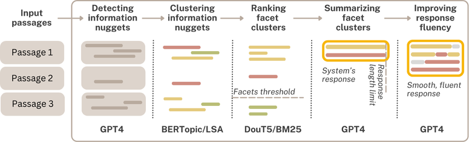

# GINGER: Grounded Information Nugget-Based Generation of Responses

[](https://github.com/psf/black)

This repository provides resources developed within the following article [[PDF](https://arxiv.org/pdf/2503.18174)]:

> W. Łajewska and K. Balog. **GINGER: Grounded Information Nugget-Based Generation of Responses.** In: Proceedings of the 48th International ACM SIGIR Conference on Research and Development in Information Retrieval (SIGIR '25). ACM. Padua, Italy. July 2025. [10.1145/3726302.3730166](https://doi.org/10.1145/3726302.3730166)

## Summary

We present a modular pipeline for **G**rounded **I**nformation **N**ugget-Based **GE**neration of
**R***esponses (GINGER). The main novelty of our approach compared to existing RAG approaches is that it operates on *information nuggets*, which are atomic units of relevant information[^1]. Given a set of passages retrieved in response to a user query, our approach identifies information nuggets in top passages, clusters them by query facet, ranks clusters by relevance, summarizes the top ones, and refines the response for fluency and coherence. GINGER uniquely models query facets to ensure the inclusion of the maximum number of unique pieces of information answering the question. This approach can significantly improve the user experience by ensuring the grounding of the final response in the source passages and enabling easy verifiability of source attribution. 

## Response Generation Pipeline

In this paper we propose a modular response generation pipeline that 1) ensures grounding of the response in specific facts from the retrieved sources, and 2) uniquely models query facets to ensure the inclusion of the maximum number of unique pieces of information answering the question. This approach can significantly improve the user experience by ensuring the grounding of the final response in the source passages and enabling easy verifiability of source attribution. 



Our method operates on information nuggets defined as *'minimal, atomic units of relevant information'* of retrieved documents that have been proposed for automatic evaluation of passage relevance[^1]. By operating on information nuggets in all intermediate components of the pipeline we ensure the grounding of the final response in the source passages and enable easy attribution verifiability. 
The details about implementation of specific components of the pipeline are covered in detail [here](response_generation/README.md).

## Data

We evaluate our system on the augmented generation task within the recently launched Retrieval-Augmented Generation track at Text REtrieval Conference (TREC RAG'24)[^2]. 

The input passages, generated data, and human scores collected for evaluation are covered in detail [here](data/README.md).

## Results

Details about the evaluation can be found [here](response_generation/evaluation/README.md).

## Citation

If you use the resources presented in this repository, please cite:

```
@inproceedings{Lajewska:2025:SIGIR,
  author = {\L{}ajewska, Weronika and Balog, Krisztian},
  title = {GINGER: Grounded Information Nugget-Based Generation of Responses},
  booktitle = {Proceedings of the 48th International ACM SIGIR Conference on Research and Development in Information Retrieval},
  year = {2025},
  pages = {2723--2727},
  series = {SIGIR '25}
}
```

## Contact

Should you have any questions, please contact `Weronika Łajewska` at `weronika.lajewska`[AT]uis.no (with [AT] replaced by @).


[^1]: Virgil Pavlu, Shahzad Rajput, Peter B. Golbus, and Javed A. Aslam. 2012. IR system evaluation using nugget-based test collections. In WSDM ’12.

[^2]: Ronak Pradeep, Nandan Thakur, Shivani Upadhyay, Daniel Campos, Nick Craswell, and Jimmy Lin. 2024. Initial Nugget Evaluation Results for the TREC 2024 RAG Track with the AutoNuggetizer Framework. arXiv:2411.09607 [cs.IR]
